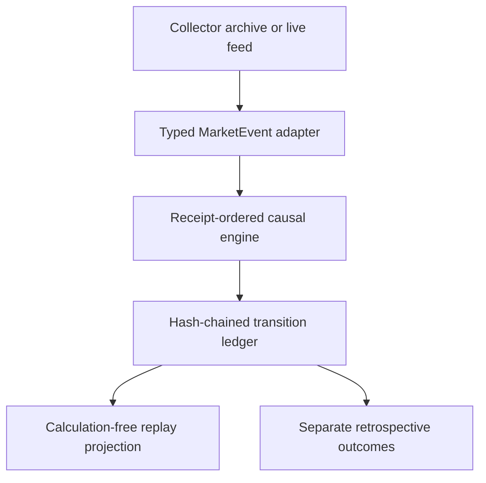

# New Divergence V1 contract

**Classification:** LIVE MARKET-PROFILING DIAGNOSTIC — NOT A BUY/SELL SIGNAL

**Production weight:** `0`

**Method:** `NEW_DIVERGENCE_V1_1_GAP_SAFE_HORIZONS`

## Design boundary



Replay and live integration differ only at the adapter. Both pass the same
immutable `MarketEvent` values to the same engine. No replay-only inference
path exists.

## Clock rules

| Clock | Contract |
|---|---|
| Internal instant | Timezone-aware UTC, microseconds retained |
| Exchange session | `Asia/Kolkata` projection of receipt time |
| Visibility | A record is visible at `receipt_timestamp`, never earlier |
| Index/Futures match | Latest visible Index receipt at or before the Futures receipt |
| Match tolerance | 2,000 ms by default; future joins are refused |
| Replay cutoff | Filters visibility only; source timestamps are never rewritten |
| Publication | `published_at == effective_at`; confirmation is never backdated to candidate start |

Naive timestamps, cross-session records, duplicate event IDs, and records older
than an emitted live watermark are refused. Source `event_timestamp` remains
evidence but does not control availability.

## Gap-safe basis classification

At each valid Futures receipt, the engine creates `basis = Futures − Index`.
For each configured 1, 3, and 5 minute horizon, it selects the last valid basis
observation at or before the horizon target using a backward-only lookup.
That reference must be within 15 seconds of the requested target and must belong
to the current uninterrupted basis segment. Any unmatched basis observation or
more than 15 seconds between valid observations starts a new segment. After a
gap, each horizon therefore rebuilds independently: 1m after one continuous
minute, 3m after three, and 5m after five.

| State | Minimum evidence |
|---|---|
| `GREEN_CANDIDATE` | Index change ≤ −10 points and basis change ≥ +5 points or causally high basis |
| `RED_CANDIDATE` | Index change ≥ +10 points and basis change ≤ −5 points or causally low basis |
| `NEUTRAL_BLUE` | Valid synchronized evidence without either divergence condition |
| `UNKNOWN_GAP` | Insufficient horizon or synchronization evidence |
| `OUTSIDE_DISCOVERY_WINDOW` | Dense observation retained, but new episode discovery is closed |

At least two configured horizons must both be valid and agree. If fewer than
two horizons are valid, the aggregate is `UNKNOWN_GAP`, never neutral or a
candidate. Expanding percentile, median, and MAD are exact online statistics
over observations visible so far. Directional/materiality thresholds remain
the recovered R6D values; gap-safe horizon validity is revision V1.1 and has a
distinct configuration hash.

## Replay rendering

Price, Futures, basis, data-gap boundaries, and divergence zones share one
receipt-time x-axis. The browser does not connect market lines across a basis
gap. Candidate and `NO_EDGE` transitions remain visible in the audit ledger but
are not coloured as divergence zones. Red/green chart shading begins only at a
causally published `CONFIRMED` transition and ends at `RESOLVED`, `ROTATION`, or
`EXPIRED`. Verified runs from an older methodology remain immutable but are
marked `Replay required` and are not eligible for the current browser; source
data must be replayed with V1.1 rather than relabelling old transitions.

### Prior-session inventory overlays

V1.0.12 may attach one immutable nightly context snapshot to a browser payload.
The snapshot's source cutoff must be strictly earlier than the replay session,
its file hashes and V2 identity must verify, and all source-chain dates must
also precede the replay date. The newest prior cutoff fails closed if corrupt;
the browser does not silently fall back to an older snapshot.

All levels use causal BankNifty Index-reference 25-point price bins:

- Futures, CE, and PE positive/negative signed OI-VPOCs remain six separate
  controls for each available 1D/2D/3D scope.
- The canonical Futures-volume profile publishes VPOC plus a contiguous 70%
  VAH/VAL for each scope. Multi-day profiles sum underlying bins before
  selecting VPOC and value area; daily winners are never averaged.
- Build flags may omit OI-VPOC or volume-profile data. GUI flags independently
  control scope, OI family, VPOC, VAH, and VAL visibility.
- Inventory controls are fixed for the replay session and carry
  `divergence_engine_input: false`. They do not alter basis horizons,
  candidates, confirmation, transitions, or zone colour.

### Developing intraday inventory overlays

V1.0.13 adds an `ID` scope whose publication clock is the replay cursor. It
starts with a new baseline at 09:45 and uses the fixed 09:45 strike selection.
Signed Futures/CE/PE OI changes are accumulated by causal BankNifty Index
25-point bins. Successive active-Futures cumulative-volume changes build a
separate VPOC and contiguous 70% VAH/VAL; the first counter, missing values,
counter resets, and material gaps contribute no volume. Only display-state
changes are projected, and no record after the cursor is rendered. This scope
also carries `divergence_engine_input: false`.

From V1.0.14, `ID`, `1D`, `2D`, and `3D` are independent display flags and all
may be switched off. A scope with no verified profile remains selectable only
when at least one of its profile families is available. Family controls are
disabled when the currently selected scopes cannot supply that family, and the
GUI states the reason. This changes browser visibility only.

## Episode lifecycle

| From | Visible condition | To |
|---|---|---|
| none | Multi-horizon candidate inside 09:45–14:30 IST | `CANDIDATE` |
| `CANDIDATE` | Same state for ≥60 seconds and ≥5 observations, gaps ≤15 seconds | `CONFIRMED` |
| `CONFIRMED` | Next same-state observation | `ACTIVE` |
| candidate | Neutral/gap/opposite before confirmation | `NO_EDGE` / `INVALIDATED` |
| confirmed or active | Neutral | `RESOLVED` |
| confirmed or active | Opposite candidate | `ROTATION` |
| open state | Explicit timeout, evidence gap, or explicit finalization | `EXPIRED` or `NO_EDGE` |

The engine does not implicitly close an episode at an arbitrary replay cutoff.
Finalization must be requested explicitly. Existing active episodes may be
observed after the discovery window, but new episodes cannot begin outside it.

## Evidence and outcome separation

Futures OI, aggregate option pressure, cash pressure, controls, and control
interactions are attached only when their receipt is visible and within the
configured age. Contradictions are recorded. None can gate or reverse the
frozen basis state.

The selected-expiry option chain is additionally retained once per source
receipt in `option_strike_oi.jsonl`. Its compact rows include absolute OI and,
when supplied by the collector, cumulative traded volume. It is a visualization
artifact, not engine evidence: the dense per-strike rows are removed before
repeated evidence snapshots are written. Browser projection calculates only
successive same-contract OI differences and resets them after the configured
participation freshness gap. Successive volume differences are published only
when cumulative volume is non-decreasing; a source reset, missing value, or
stale gap produces no volume bar.

V1.0.13 also retains each normalized active-Futures tick in
`futures_market.jsonl` with its receipt, price, cumulative volume, symbol, and
event identity. The ID volume profile accepts only a positive successive
counter difference that has an exact verified basis observation—and therefore
a causal synchronized BankNifty Index coordinate—at that Futures receipt.

### Fixed 09:45-close strike-flow selection

The 09:15–09:45 interval is a warm-up window. From the hashed synchronized
`basis_observations.jsonl`, projection selects the last BankNifty Index receipt
at or before 09:45:00 IST. It is valid only when no more than the configured
Index/Futures match tolerance (2,000 ms by default) precedes 09:45. The browser
then waits for the first complete selected-expiry option-chain receipt visible
at or after 09:45 and freezes these contracts for the remainder of the session:

| Panel family | Strike 1 | Strikes 2–4 |
|---|---|---|
| CE | Nearest common listed CE/PE strike to the 09:45 BN close | Next three higher listed CE strikes |
| PE | Same ATM strike | Next three lower listed PE strikes |

An exact distance tie chooses the lower listed strike. The four flow panels are
CE signed ΔOI, PE signed ΔOI, CE incremental volume, and PE incremental
volume. Their first post-09:45 chain receipt is a baseline, so no pre-09:45
change is carried into a bar. The CE/PE projection is server-side bounded at
09:45: pre-boundary strike rows are not returned to snapshots, flow panels, or
prefix API consumers. All panels use the main price chart's exact visible
receipt-time domain. A missing/stale 09:45 close or incomplete strike ladder
is shown as unavailable and never triggers fallback selection or intraday
recentering. From V1.0.15 the main synchronized Index/Futures, absolute
Futures-OI, basis, state, transition, and confirmed-zone series retain their
full session history. Futures ΔOI bars are blank before 09:45 and restart from
a fresh 09:45 baseline; the CE/PE flow, cash-participation, and ID inventory
families remain strictly post-09:45.

The CE and PE right rail is a current-receipt snapshot rather than a historical
bubble map. Each horizontal bar represents absolute OI, the printed secondary
value is the latest signed ΔOI, and both panels share one OI scale. A dashed,
labelled BankNifty Index line distinguishes the current Index value from the
option-strike labels. Historical changes remain in the four aligned flow
panels, avoiding duplicate overplotting in the narrow right rail.

`outcomes.py` is an offline consumer of confirmed transitions and later Index
observations. Its records say `NOT ENGINE INPUT` and retain production weight
zero. The inference module has no import of the outcome module.

## Dynamic data discovery

- Collector archive members are selected by session-shaped paths, not a list of
  known dates.
- The Index and active BankNifty Futures symbol come from the latest same-session
  collector startup metadata. An explicit symbol may be supplied for audit. If
  neither is available, the run fails instead of guessing from archive order.
- Compressed tar members may be physically unordered. Selected normalized
  records are externally sorted in bounded temporary chunks without unpacking
  the raw archive tree.
- Selected JSONL is strict by default: malformed records fail the run, and a
  missing source event/request clock is never replaced with receipt time.
- Target-symbol feed updates without a positive finite trade price are not
  ticks. They are excluded with an explicit count rather than treated as zero
  prices or mislabeled as malformed JSON.
- A session becomes browser-eligible only after a completed run has observations
  and a verified ledger. The catalog derives 1/2/3-session scopes from the
  actual earlier eligible sessions, so weekends, holidays, and missing inputs
  are naturally skipped.

## Published run layout

```text
run-root/
  catalog.json
  <discovered-session>/
    cash_participation_1m.jsonl
    sample_manifest.json
    basis_observations.jsonl
    evidence_snapshots.jsonl
    transitions.jsonl
    diagnostics.jsonl
    option_strike_oi.jsonl
    futures_market.jsonl
    session_reference.json
    engine_config.json
    source_manifest.json
    summary.json
```

Each session is built under a staging directory and atomically renamed into
place. An existing session directory is never overwritten. The transition
ledger links each canonical JSON record to the prior SHA-256 and can be checked
independently with `verify-ledger`. A non-empty ledger cannot be resumed because
engine-state restoration is not implemented; the runtime fails closed instead
of pretending that a hash chain alone restores causal state.

`source_manifest.json` nests the input provenance and a per-file SHA-256
inventory of the New Divergence runtime, plus one aggregate source-tree hash.
`summary.json` binds every other run artifact by SHA-256. Catalog eligibility,
browser builds, and outcome evaluation independently recompute those hashes and
refuse a modified or incomplete run.

## Operational boundary

Replay, catalog, browser construction, ledger verification, and retrospective
outcome evaluation are finite commands. They do not start a process. `serve` is
read-only, binds to `127.0.0.1` by default, and refuses to start without an
explicit research-only acknowledgement.

When explicitly started, the read model exposes `GET /api/v1/catalog` and
`GET /api/v1/sessions/<session>?as_of=<absolute-time>`. An `as_of` response
contains only observations whose receipt and transitions whose publication are
at or before that instant. Futures OI, option-strike OI/volume, cash breadth,
and participant-volume receipts are independently prefix-filtered by the same
cutoff. It reads completed projection files and cannot call the inference
engine.
