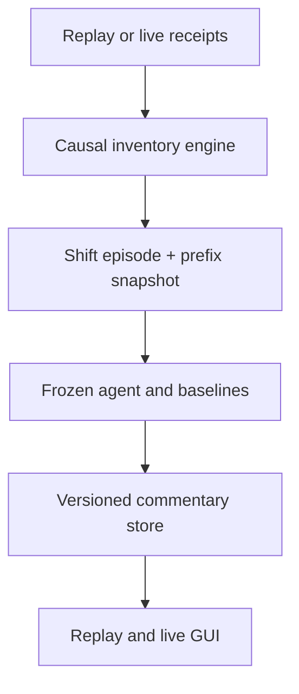

# Concept and System Design

## Objective

Explain each meaningful CE, PE, Futures-OI, and BankNifty-reference volume
inventory shift once, centrally, and causally. Store the result so replay and
live GUIs display the same compact commentary without starting a Codex request
from every browser tab.

The commentary has two distinct jobs:

1. describe what changed in the visible causal prefix;
2. state a separately scored possible outcome for a fixed horizon, including
   candidate support, resistance, confidence, and invalidation.

These jobs must remain separate. A correct description does not prove a useful
forecast.

## Centralized event flow



The backend owns the analytical lifecycle:

1. Detect a control migration or consolidated same-time shift episode.
2. Build a prefix-only snapshot ending at the triggering receipt.
3. Deduplicate by instrument, session, episode identity, input hash, forecast
   horizon, and agent version.
4. Run the deterministic agent and explanation layer once.
5. Validate the response schema and evidence references.
6. Store `READY` or a bounded `FAILED` record.
7. Let any GUI retrieve the stored record by episode identity.

The GUI button is therefore a reveal/retrieve action, not a per-tab model
invocation. Browser tokens and browser-local analytical state are unnecessary
for the final architecture.

## Canonical commentary record

Every stored record should contain:

- `instrument_id`, `session_id`, `episode_id`, and `causal_cutoff`;
- source/input hash, inventory-engine version, agent version, and schema version;
- the exact CE/PE/Futures/volume control migrations that triggered the episode;
- current Index, Futures, basis, fresh OI/flow context, and prior-profile status;
- fixed horizon, direction class, calibrated confidence, and abstention state;
- ranked support and resistance candidates with provenance;
- invalidation condition and data-quality limitations;
- compact GUI commentary and structured evidence references;
- processing state and timestamps.

The stored record must never contain future observations in its input section.
Outcome labels live in evaluation storage, not commentary storage.

## Compact GUI contract

The default view should fit in a few lines:

```text
SHIFT   PE addition moved lower; CE inventory redistributed above ATM; Futures OI eased.
READ    Put support strengthened below price, but Futures participation did not confirm.
NEXT    30m: ROTATION / modest upside only above the stated resistance.
LEVELS  Support 57450-57475 | Resistance 57500-57600
RISK    Low confidence; invalid below support; prior context unavailable.
```

The exact values come from the stored structured record. A user may expand the
evidence trace, but the compact view remains the primary replay/live commentary.

## Causal invariants

- All joins are backward as-of joins at receipt time.
- The causal prefix ends at the triggering receipt.
- Prior 1D/2D/3D profiles use only strictly earlier eligible sessions.
- Missing inputs remain explicitly unavailable; they are never fabricated.
- The first observation of a family establishes a baseline and is not a shift.
- Several migrations at one receipt become one episode.
- Deterministic IDs and hashes make restarts idempotent.
- Replay and live paths consume the same canonical event schema.
- Internal timestamps are normalized; display conversion is separate.
- No session date, symbol, expiry, strike step, or filesystem root is hard-coded
  into the generic analytical contract.

## Forecast boundary

Forecasts are fixed-horizon, three-class outputs: `UP`, `DOWN`, or `ROTATION`.
An agent may abstain when evidence is weak. Forecasts, level rankings, and
commentary are versioned separately so prose changes cannot alter scores.

Automatic production promotion is forbidden. The required sequence is:

1. training-only candidate creation;
2. validation against deterministic baselines;
3. one-time sealed holdout evaluation for a frozen selection;
4. prospective shadow sessions;
5. explicit human review before any product integration.
